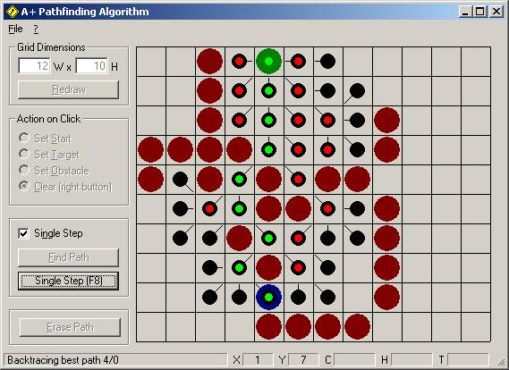



## A\+ Pathfinding Algorithm

### Description

Implementation of the fast A+ Pathfinding Algorithm, complete with testing environment, guiding you through the algorithm step by step.
 
### More Info
 

             |
---                |---
**Submitted On**   |2005-10-06 11:00:10
**By**             |[Herbert Glarner](https://github.com/Planet-Source-Code/PSCIndex/blob/master/ByAuthor/herbert-glarner.md)
**Level**          |Intermediate
**User Rating**    |5.0 (45 globes from 9 users)
**Compatibility**  |VB 6\.0
**Category**       |[Complete Applications](https://github.com/Planet-Source-Code/PSCIndex/blob/master/ByCategory/complete-applications__1-27.md)
**World**          |[Visual Basic](https://github.com/Planet-Source-Code/PSCIndex/blob/master/ByWorld/visual-basic.md)
**Archive File**   |[A\+\_Pathfin1937941062005\.zip](https://github.com/Planet-Source-Code/herbert-glarner-a-pathfinding-algorithm__1-62790/archive/master.zip)

